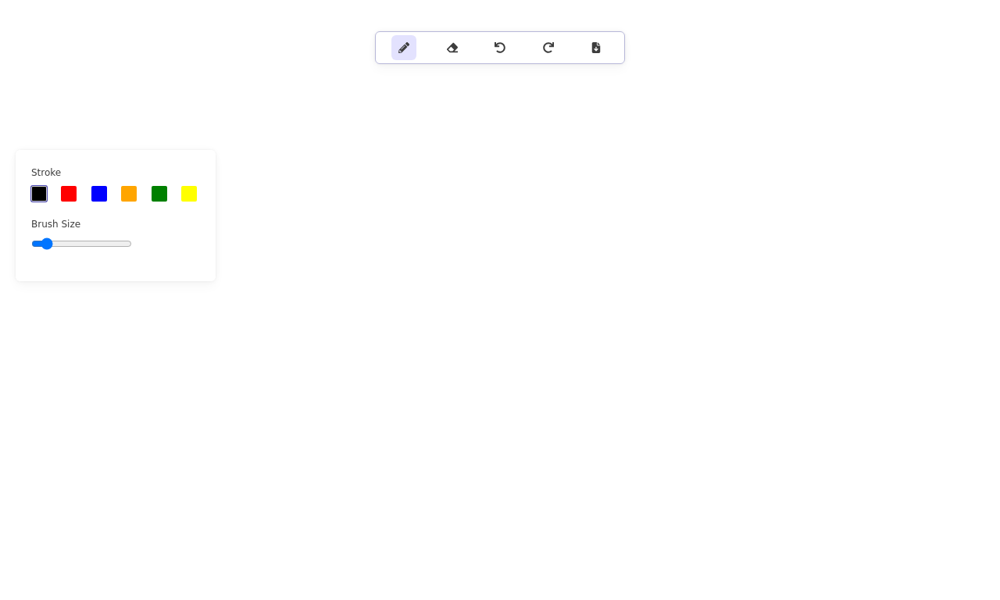

# Drawing Tool

This is a real-time collaborative drawing tool built using Socket.io, Next.js, and Tailwind CSS.

## Features

- Real-time collaboration: Multiple users can draw simultaneously and see each other's changes in real time.
- Drawing tools: Includes tools such as pencil, brush, eraser, and color picker.
- Vercel deployment: Hosted live at [https://drawing-tool-pi.vercel.app/](https://drawing-tool-pi.vercel.app/).

## Technologies Used

- **Frontend**: Next.js, Tailwind CSS
- **Backend**: Socket.io
- **Deployment**: Vercel
